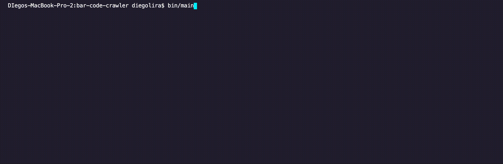

# Walmart Mexico Barcode Crawler

This project is crawler made to fetch data from the Walmart Mexico website site from a list of barcodes selected by the user. 

This version is optimized to work with deodorants, perfurms and shampoos. Other products were not tested in this crawler.



## Built With
* Ruby
* Watir Gem
* Nokogiri Gem
* Terminal Table Gem

## Video Explanation

Here is the [video explanation](https://www.loom.com/share/fe7e6d6b89be4cdc93f67d9be69795ff) of this project.

## Prerequisities

To get this project up and running locally, you must already have ruby and necessary gems installed on your computer.

## Installation

**Step 1**<br>
Navigate through the local folder where you want to clone the repository and write<br>
``` git clone git@github.com:gurbuzertunga/ruby_slack_bot.git```. It will clone the repo to your local folder.<br>
or with https<br>
```git clone https://github.com/lirad/walmart-barcode-crawler.git```.<br>
**Step 2**<br>
Run ```cd walmart-barcode-crawler```<br>
**Step 3**<br>
Run ```bundle install``` to get the necesary gems.<br>
**Step 4**<br>
Go to the folder ``input`` and update the bar_code.csv with the desired bar codes. The crawler is optimized to work with perfurms, deodorants and shampoos. <br>
**Step 5**<br>
Run ``bin/main``<br>
**Step 6**<br>
See the list of products outputed or navigate to ``output`` to get a CSV file.<br>

## Testing

To the test the codes you must run ``rspec`` from the project folder

## Authors

👤 **Diego Lira**
- Github: [@lirad](https://github.com/lirad)
- LinkedIn: [@lirad](https://www.linkedin.com/in/diegoalira/)

## :handshake: Contributing

## Show your support
If you've read this far, you must like the project! Give us a :star:️!

## Acknowledgments
- Our thanks to Microverse and all our peers and colleagues there.

## :memo: License
This project has no license
